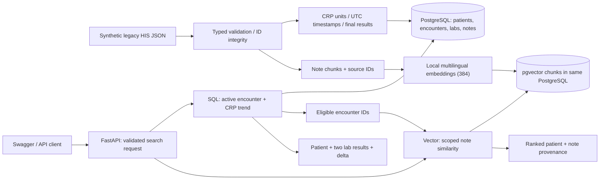
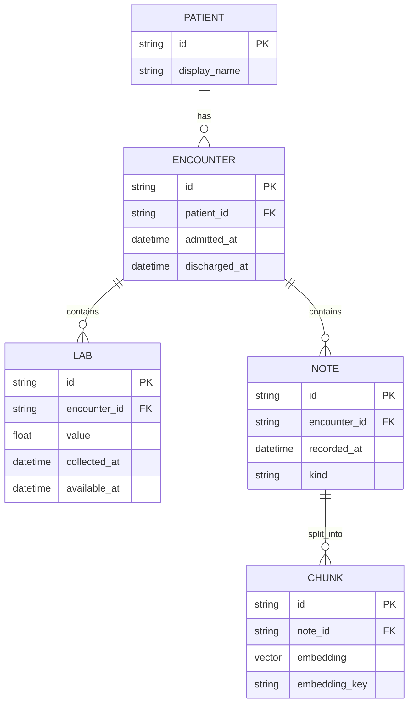

# Architecture

## 사용자 문제와 MVP

병동 의료진이 입원정보, 검사결과, 진료기록을 각각 조회하고 수작업으로 연결해야 하는 문제를 다룹니다. 병원 IT 관점에서는 기존 HIS를 변경하지 않고 AI 검색 계층을 붙이는 통합 구조를 보여줍니다. 핵심 결과물은 진단이나 생성 요약이 아니라 **조건을 만족하는 환자와 검증 가능한 근거**입니다.

## 데이터 연결의 기준

환자 ID만으로 합치면 이전 입원의 감염 기록이 현재 입원의 검사 수치와 연결될 수 있습니다. 모든 검색과 결합의 기준은 `encounter_id`입니다. 합성 데이터는 중복 입원 시간 범위를 거부하므로 조회 시점에 환자당 입원 건 하나가 활성 상태입니다.

## Structured

1. 기간 내 CRP 중 조회 시각까지 채혈되고 확정된 결과를 선택합니다.
2. `row_number()`를 입원 건별로 적용해 채혈 시각 기준 최근 두 결과를 선택합니다.
3. 두 결과가 서로 다른 시각이고, 최근 값 − 이전 값이 요청 임계값보다 큰지 검사합니다.
4. 조회 시각에 활성인 입원 건만 반환합니다. 입원 시각은 포함, 퇴원 시각은 제외합니다.

## Vector / Hybrid

Vector는 활성 입원, 기록 시각, 환자와 기록 종류 필터를 먼저 적용합니다. Hybrid에서는 SQL이 반환한 입원 ID 제한을 같은 후보 쿼리에 추가합니다. pgvector cosine distance로 순위를 정한 후 입원별 최상위 청크 하나를 선택하고 전체 top-k를 반환합니다. 같은 환자의 여러 청크가 결과 슬롯을 모두 차지하지 않습니다.

정형 조건은 반드시 만족해야 하는 제약이므로 RRF나 가중합으로 완화하지 않습니다. 여기서 Hybrid는 BM25+vector가 아니라 **관계형 조건과 비정형 의미 검색의 결합**입니다.

## 실행 경계와 관찰

- `init`이 DDL과 합성 데이터 적재를 수행합니다. API에는 데이터 변경 endpoint가 없습니다.
- DB 트랜잭션의 repeatable-read로 Hybrid의 여러 읽기가 같은 snapshot을 사용합니다.
- 적재는 transaction + advisory lock으로 중복 실행을 직렬화합니다.
- DB 연결 대기 5초, 개별 statement 10초 제한을 둡니다.
- 응답은 결과 수와 elapsed_ms를 반환합니다. 로그에는 검색어와 환자 ID를 남기지 않습니다.
- Liveness는 프로세스만, readiness는 DB/적재 여부/모델 키를 검사합니다. readiness는 모델 추론 속도나 품질을 보장하지 않습니다.
- 모델은 프로세스에서 최초 필요 시 로딩하고 캐시합니다. 초기 요청 지연과 steady-state 지연은 다를 수 있습니다.
